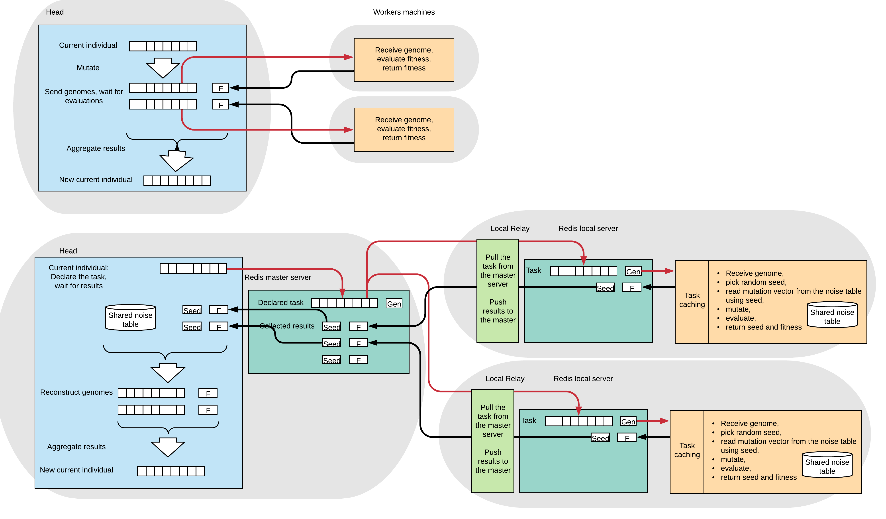
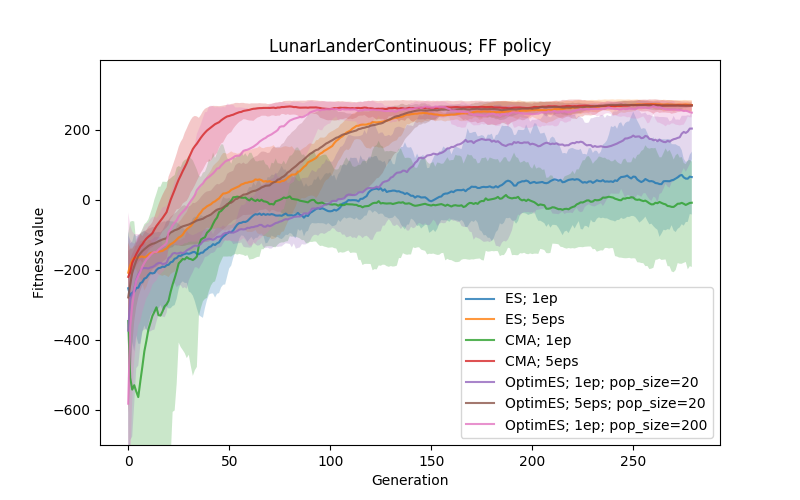
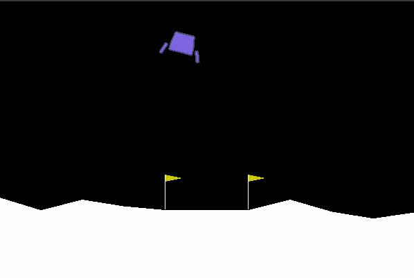
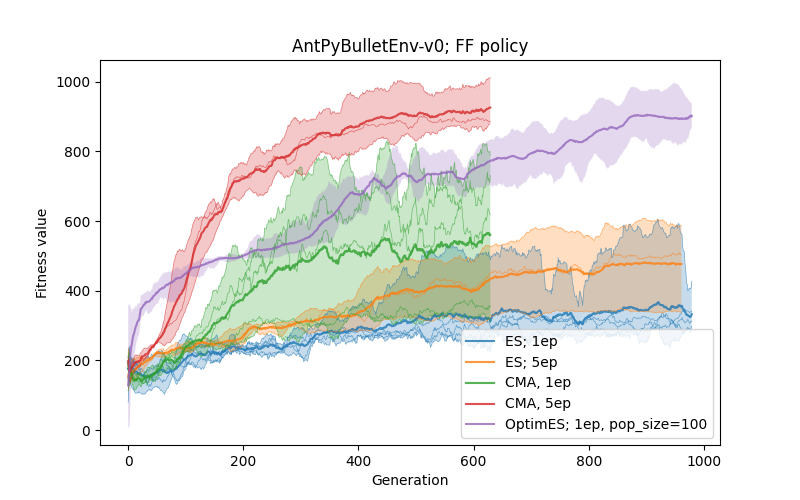
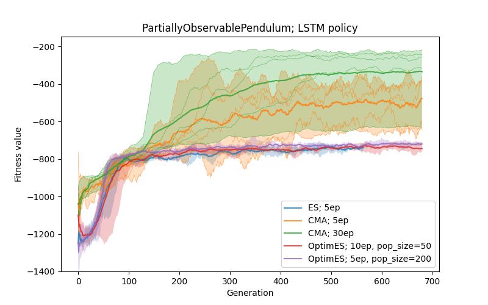

# Distributed Evolutionary Computation on RL Tasks

*By Jaroslav Vítků* \
*[GoodAI](https://www.goodai.com/)*

Currently, we are experimenting with experimental setup proposed in our 
Badger [paper](https://arxiv.org/pdf/1912.01513.pdf).
One of the areas of explorations is an evaluation of suitability of various training settings: 
supervised learning, Deep Reinforcement Learning (RL) and evolutionary optimization.

Here, we were inspired by the paper [Evolution Strategies as a Scalable Alternative to Reinforcement Learning](https://arxiv.org/pdf/1703.03864.pdf)
from OpenAI, where authors show that, despite lower sample efficiency in general,
the Evolutionary Strategies (ES) can achieve faster wall-clock time convergence compared to state of the art RL 
algorithms due to its suitability for parallelization. 

In order to get practical experience with evolutionary computation and it’s applicability on our tasks in general,
we have created a small repository which allows us to run OpenAI’s ES and algorithms from facebook’s 
Nevergrad [library](https://engineering.fb.com/ai-research/nevergrad/) comparably on standard OpenAI gym RL tasks.
A nice visual introduction to the ES can be found [here](https://blog.otoro.net/2017/10/29/visual-evolution-strategies/).

The repository with code can be found on our GitHub, instructions how to run the experiments are available in the [setup/README.md](setup/README.md).

# OpenAI’s ES & Paralellization

In order to get hands on experience with ES and it’s suitability for paralellization across multiple cores and/or 
multiple machines we started with [OpenAI’s ES implementation](https://github.com/openai/evolution-strategies-starter), which supports scalability across many AWS instances.
 We have modified it on multiple places for our purposes, but we have not changed the core of the computation. The changes include mainly:
 * Now uses PyTorch networks & pybullet environments
 * Experiments configured and logged using the [Sacred tool](https://github.com/IDSIA/sacred/)
 * Direct comparison of results with ES algorithms from the [Nevergrad library](https://engineering.fb.com/ai-research/nevergrad/)
 * Simplifications/improvements on several places (e.g. auto-restart of workers on new experiments etc)
 * Slightly different AWS setup & cluster management scripts
    
Below, we describe the difference between simple parallelization of ES and OpenAI’s optimized one.
 In the simple case, the head generates mutated individuals, sends them across the network to workers (red lines) and waits for fitness evaluations.
  Here, genome of each individual is sent over the network, which can be communication intensive in case of big genome sizes. 
  

The bottom part depicts the OpenAI’s implementation of the ES.
 Each generation, genome of only the current individual (Task) is sent to the server.
 Each worker pulls the genome from the server, generates random position in the shared noise table (Seed),
 reads mutation vector from this position, applies the mutation and evaluates the resulting genome.
 Workers respond just with the Seed integer and evaluated fitness value. Using the Seed values, the head is able to reconstruct the original mutation vectors locally. This way the entire genome is sent only once per geneation (red lines) over the network and workers communicate just with two scalar values. 
 Note that similar efficient communication was employed for Genetic Algorithm in [this paper](https://arxiv.org/abs/1712.06567).

# Example results
 
Here we compare the CMA-ES and ES from the Nevergrad library with OpenAI’s ES on selected RL tasks.
Below, algorithms from Nevergrad library are denoted as "ES" and "CMA", OpenAI's ES is denoted as "OptimES" (since it uses Adam optimizer).
Graphs are result of 5 independent runs for each configuration.
For the fitness of the current individual, the mean value and min/max range are shown.
The CMA adn ES were ran with default configuration, all other experiment settings can be found in the repository.
The Nevergrad library uses own initialization of genome (linear encoding of the network parameters), while in case of OpenAI's ES the standard PyTorch initialization is used.
The OpenAI's ES also includes penalty for size of weights, which is not used in case of ES and CMA.

### LunarLanderContinuous

This is a classical simple RL task solvable by a small feed-forward policy.
In this case, the policy is parametrized by just two output neurons (number of parameters is 18).

The three algorithms are compared, in addition that OptimES uses different settings.
The "5ep" means that the fitness is computed as a mean of 5 runs in randomly initialized environment.
It can be seen that mitigation of noise in the evaluation is important (especially for ES and CMA).

Problems with the noise can be addressed either by averaging the fitness value from multiple runs 
or partially by increasing the population size (which is easier to parallelize) in the case of OptimES.

Here is an example of learned policy.

### AntPyBulletEnv

Next comparison is done on higher-dimensional problem, here, the policy is parametrized by feedfoward network 
with two hidden layers of size 64 with ReLU activations and discretized actions (resulting in 6536 parameters). 
It is evaluated on the [AntPybullet environment](https://github.com/benelot/pybullet-gym).

Here, in case of 1 episode per fitness, we can see that only the OptimES works well,
 while the ES usually learns just how not to fall, and results of CMA depend on the initialization 
 (also it died on out-of-memory error).
 
When averaging the fitness from 5 episodes, we can see that CMA starts to converge very fast and with a small variance 
(results from just 3 runs), the performance of ES is slightly improved as well.
 
Again, the robustness of convergence (even with noisy gradient estimate from 1 episode) of OptimES is probably caused by
 use of the Adam optimizer. It is worth noting that in case of this algorithm,
 there are more hyperparameters that need to be chosen well (mainly the sigma and learning rate of the optimizer),
  and in many tested configurations it had problems with the convergence (in the case of 1ep setting).

In terms of wall-clock speed, the ES and CMA were ran on single machine with ~8 workers, and achieving speed of about *15s/generation* 
(the 1ep case!), while the OptimES was ran on a cluster with around 10 *t3.2xlarge* instances (8 workers per machine) and achieving around 
 *2s/generation*, which could be improved further easily.

As mentioned in the original [paper](https://arxiv.org/pdf/1703.03864.pdf), it was noticeable that policies found by
 ES exhibit much higher diversity compared to those found by Deep RL.

Here are examples how some policies observed during evaluation, we can see different gaits or even jumping.

### PartiallyObservablePendulum

This is a partially observable version of the pendulum task (as described [here](https://arxiv.org/pdf/1512.04455.pdf)),
 where the velocity of the pendulum is hidden. 
Here, the policy has to infer the velocity from consecutive observations,
 therefore it is parametrized by the LSTM network with 1 hidden layer of 16 cells and linear activation on the output layer 
 (this results in 1361 parameters).

Here, in case of good initialization of network weights, the CMA can find an acceptable (but not perfect) solution.
Otherwise, the algorithm gets stuck in the state where the policy is able to swing up the pendulum,
 but is unable to apply the opposite force to stop its rotation.

In this case, all algorithms had problems with finding a good policy even in the case of 5 evaluations per fitness. 
One of possible reasons can be that initial conditions influence the states more (so more evaluations could help),
 another possibility is that the task is more demanding on the precision of actions and/or that discovery of the memory
  mechanism and its usage is non-trivial.

Therefore we ran CMA was ran with 30 episodes per fitness, which considerably helps with the performance and stability.

It is also notable that the CMA behaves quite differently from other algorithms at the beginning of the run.

# Discussion

From these initial experiments it seems that ES is a competitive alternative to Deep RL.
It has some properties that are potentially beneficial (differentiable model not required, 
bigger diversity in resulting policies..), but there are some limitations as well.

The OpenAI’s ES is scalable across many machines and by its simplicity more suitable for high-dimensional
 problems and by employing the optimizer it is more robust against fitness evaluation noise.
 On the other hand, it has more hyperparameters that need/can be optimized (mainly the sigma, learning rate..).
 In the partially observable task it did not perform well and got stuck in a local optimum.

Compared to that, the CMA-ES does not require the sigma parameter (and converges faster due to computation of the full 
covariance matrix) and usually converges faster (in terms of sample efficiency).
But it is not scalable to higher-dimensional problems and not parallelizable well.

# Possible next steps

All the mentioned limitation have been already addressed to some degree.
For example, algorithms like [novelty search](https://arxiv.org/abs/1712.06567) or 
[open-ended methods](https://arxiv.org/abs/2003.08536) try to address the problem with local optimum. 

The scalability of CMA-ES-like approaches has been dealt with e.g. [here](https://arxiv.org/pdf/1903.04268) or [here](https://arxiv.org/abs/1705.06693).

These directions be worth looking at in the future.

